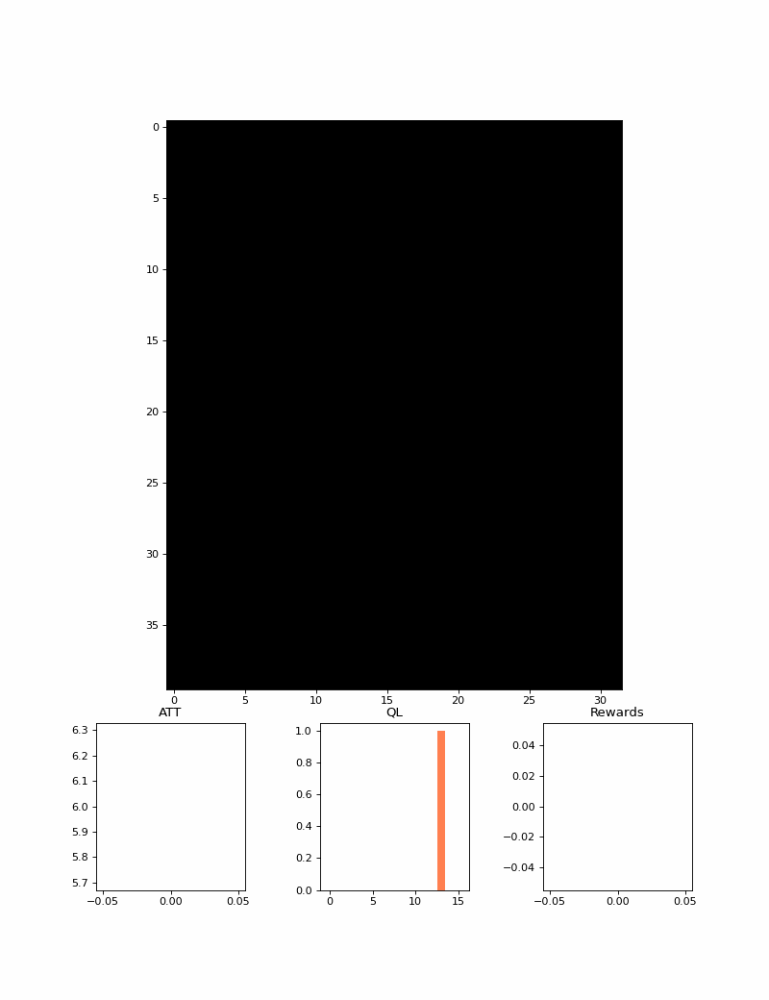

<p align="center">
  
</p>

<!-- ABOUT THE PROJECT -->
## About Amgu

The majority of paper in the subject of DRL & traffic mannagment don't share thier code or the
data they used for train.
There is an need to organize & create uniforms between paper &code a like.
Amgu try to execly do that, creating abstract classes that can be hierarchical from
and be easy to use and prevent cooled start. Traffic Managment System (including agent) has been created using thoes classes.Amgu-Traffic enable developer to use easy API with custom & premade
model and envierments & Attacks on thoes.

<p align="center">
  
</p>


### Built With

Amgu has been built using, the following:

* [Python](https://www.python.org/)
* [PyPi](https://pypi.org/)
* [Cityflow](https://github.com/cityflow-project/CityFlow)
* [Ray-rllib](https://github.com/ray-project/ray/blob/master/python/ray/rllib)

<!-- GETTING STARTED -->
## Getting Started

To use this project you'll need to have CityFlow already install inside your pip enviorment.
In Addition ray should be installed custom to your machine(x86/x64).

### Installation

Bellow example show the step to install and run example of Amgu.
1. Install Amgu Traffic using Pypi.
   ```sh
      pip install Amgu/.
   ```
2. Use in your code.
   ```python
      from Amgu.basic.env import CityFlow1D
      from Amgu.basic.reward import *
      from Amgu.basic.models import Random
      from Amgu.basic.evaluate import evaluation_generator
      from Amgu.visualization.graph import line_graph
      from Amgu.runnner import stable_baseline_train
      from stable_baselines3 import DQN

      exp_name = "DQN_delta_waiting_time_1x1"
      stable_baselines_config = {
          "experiment_name": exp_name,
          "env_config": {
              "config_path": "example/1x1/config.json",
              "steps_per_episode": 400,
              "save_path": "example/1x1/res/",
          },
          "env_param": {"reward_func": queue_length, "district": True},
          "policy_param": {
              "policy": "MlpPolicy",
              "tensorboard_log": f"{exp_name}/tesnorboard",
              # 'policy_kwargs': dict(activation_fn=th.nn.ReLU, net_arch=[146,50,8]),
              "gamma": 0.95,
              "learning_rate": 0.005,
              # "exploration_initial_eps": 1,
              # 'exploration_fraction': 0.9,
              # "exploration_final_eps": 0.15,
              # 'target_update_interval': 1_000,
          },
          "evaluation_interval": 400,
          "evaluation_duration": 1,
          "stop": {"training_iteration": 2_000},
      }
      stable_baseline_train(DQN, CityFlow1D, stable_baselines_config)
   ```

<!-- ROADMAP -->
## Roadmap
- [x] Abstract Class.
- [x] Traffic Class (using cityflow).
- [x] Add Documntation.
- [x] Build Test

See the [open issues](https://github.com/dev0Guy/amgu/issues) for a full list of proposed features (and known issues).

<!-- LICENSE -->
## License

Distributed under the MIT License. See `LICENSE` for more information.

<p align="right">(<a href="#top">back to top</a>)</p>
